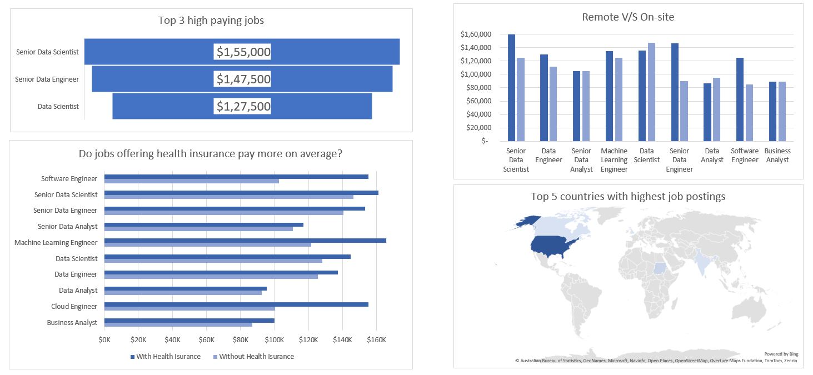
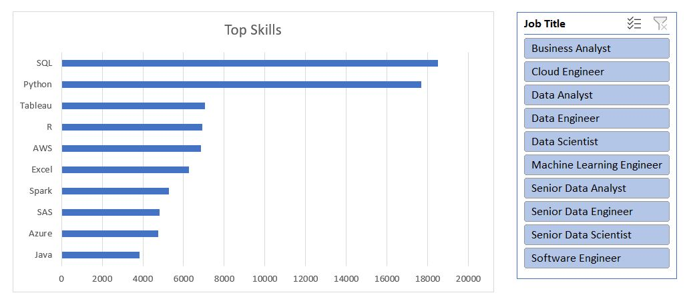

# Data Science Job Market Analysis (Excel Dashboard)

This project is a **data analysis and dashboard** built using **Microsoft Excel** on a dataset containing daily job postings related to data science roles. The dataset was provided by [Luke Barousse](http://www.youtube.com/@LukeBarousse).

The analysis was performed using **Excel Pivot Tables** and **Power Query Editor** for data cleaning and transformation. Various bar charts and visualizations were created to make the insights easy to understand.

## Key Questions Answered

The project answers the following questions using Excel:

1. Which job titles have the highest median salary?
2. How does salary compare between remote and on-site jobs?
3. Do jobs offering health insurance pay more on average?
4. Which countries have the highest number of data job postings?
5. What are the top 10 most in-demand skills across all jobs?

## Screenshots

## Tools & Techniques Used

- **Microsoft Excel**
- **Pivot Tables**
- **Power Query Editor**
- **Data Cleaning & Transformation**
- **Data Visualization (Bar Charts)**
- **Slicer**